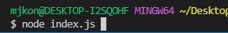
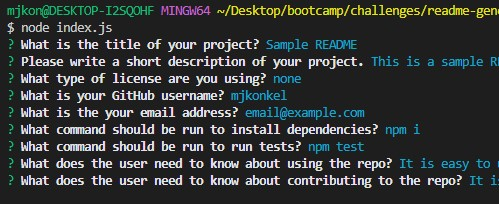

# README.md Generator
  
  ## Description
  This repo contains code for Challenge 9 of the Bootcamp. This week our assignment was to create a CLI app to generate a README file that can be used for future projects. This app uses inquirer the ask the user what they would like to include in their README. It also uses fs to create the README template. The README is generated and added to the readme folder of the repo. 
  
  ## Installation
  This project uses inquirer. Inquirer was installed by running `npm i`
  
  ## Usage
  >To use the README generator, enter `node index.js` into the Command Line.  
    
  
  >This will display the prompts for the user to create their README.  
  
  ## License
  MIT License. Please refer to the license in the repo.
